# IoT Hygrometer

<figure>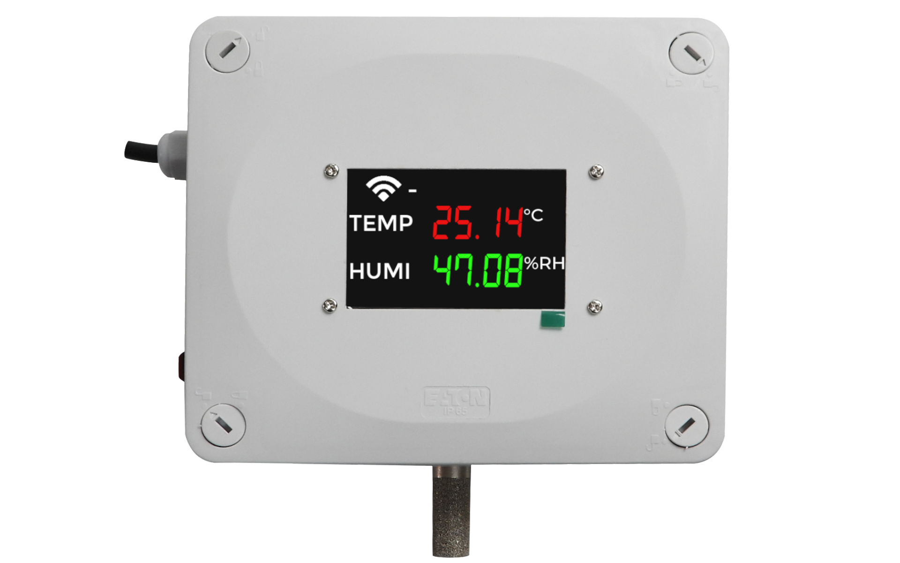<figcaption></figcaption></figure>

El **Higrómetro IIoT** es un dispositivo diseñado para monitorear la temperatura y humedad en procesos de producción industriales, la conectividad inalámbrica por Wifi permite obtener información en tiempo real a cualquier hora en cualquier parte del mundo a través de internet. El sensor integrado tiene un rango de detección de 0 °C a 85 °C con una precisión típica de +/- 0.2 °C y +/- 1.8% **RH** (humedad relativa), implementa un mecanismo de **calibración automática,** lo que le permite funcionar por largos periodos de tiempo antes de requerir mantenimiento, con una desviación típica menor a <0.03°C al año y <0.2%RH al año\*\*.&#x20;


**\*:** El mecanismo de calibración automática solo es operativo en ambientes de temperatura de 5 °C a 60 °C y de 20 %RH a 80 %RH.

**\*\*:** La desviación típica anual está sujeto al ambiente de operación, ambientes de alta humedad relativa y con alta concentración de contaminantes como, por ejemplo, acetona, causarán un envejecimiento acelerado del sensor.


## Tabla de contenido

1. [¿Cómo funciona?](iot-hygrometer.md#i.-como-funciona)
2. [Descripción del Hardware](iot-hygrometer.md#ii.-descripcion-del-hardware)
3. [Instalación](iot-hygrometer.md#iii.-instalacion)
   * [Desempaquetado](iot-hygrometer.md#id-1.-desempaquetado)
   * [Conexión a la red eléctrica](iot-hygrometer.md#id-2.-conexion-a-la-red-electrica)
   * [Conexión a la nube](iot-hygrometer.md#id-3.-conexion-a-la-nube)
   * [Recibir notificaciones](iot-hygrometer.md#id-4.-recibir-notificaciones-automatizaciones)
   * [Conectar el dispositivo a una nueva red Wifi](iot-hygrometer.md#id-5.-conectar-el-dispositivo-a-una-nueva-red-wifi)
4. [Preguntas frecuentes y solución de problemáticas](iot-hygrometer.md#iv.-preguntas-frecuentes-y-solucion-de-problematicas)

## I. ¿Cómo funciona?

El **Higrómetro IIoT** integra un sensor de temperatura y humedad con un rango de detección de 0 °C a 85 °C con una precisión típica de +/- 0.2 °C y +/- 1.8% RH. Este sensor implementa un mecanismo de calibración automática que opera en ambientes de temperatura de 5 °C a 60 °C y de 20 %RH a 80 %RH. Exposición prolongada fuera de este rango, especialmente a alta humedad relativa, puede ocasionar una desviación temporal en las mediciones de RH. Después de la exposición y una vez dentro de los rangos de operación recomendadas, el mecanismo de calibración restablecerá el sensor a los rangos de precisión típica, lo que le permite operar durante largos periodos de tiempo antes de requerir mantenimiento. Exposición prolongada a ambientes adversos, especialmente ambientes de alta humedad relativa y con alta concentración de contaminantes como, por ejemplo, acetona, acelerará el envejecimiento del sensor. El sensor se encuentra protegido por una **cubierta de acero\*** inoxidable sinterizado, su diseño de poros reduce el ingreso de polvo y otras partículas que pueden obstruir el funcionamiento del sensor.


**\*:** La cubierta de acero incrementa el tiempo inicial en el cual el sensor alcanza el equilibrio térmico con el ambiente. Por lo que una vez instalado y operativo, el sensor puede tener una pequeña desviación de temperatura y humedad por un breve periodo de tiempo, típicamente de 1 minuto. Considere esta limitación si va a reubicar el dispositivo.


El dispositivo está basado en nuestra plataforma **XIDE**, incluye la tarjeta de expansión **X-BOARD IIoTrainer**, con 5 zócalos de expansión [**mikroBUS™**](https://www.mikroe.com/mikrobus), la metodología basada en bloques permite expandir la funcionalidad del dispositivo incluso una vez fue desplegado en campo. No requiere un especialista para su instalación, solo inserte el bloque en un zócalo disponible/apilable. Solo hace falta una actualización de firmware, que puede recibir a través de internet, para añadir funcionalidad a su dispositivo. Consulte nuestro catálogo de [XNODE's ](https://docs.microside.com/plataforma-xide/xide-iot-i4.0/i4.0/x-nodes)y [Click Boards™](https://www.mikroe.com/click-boards).


El desarrollo y despliegue de nuevas funcionalidades **NO** se incluyen en la adquisición del dispositivo, consulte con un represente de ventas acerca de los términos y condiciones sobre las actualizaciones de firmware.


El dispositivo integra:

* **X-NODE Power Supply AC:** Fuente de poder con un rango de operación 110 a 220 VAC que proporciona alimentación para todo el sistema.
* **X-NODE MCU WIFI BLE:** Módulo de conectividad inalámbrica Bluetooth/BLE y Wifi de 2.4 GHz, controlador del sistema que permite conectar el dispositivo a la nube a través de Wifi.
* **X-NODE Expansion Signal:** Módulo de clemas que permite conectar el sensor temperatura/humedad tipo sonda al sistema.&#x20;
* **Pantalla TFT:** Con una resolución de 320x480px de 3.5″ que muestra los valores de temperatura y humedad, además del estado de la red y conexión con la nube.

El gabinete con cierre hermético IP65, protege al dispositivo contra elementos de agua y polvo, permitiendo su instalación en ambientes industriales, el material termoplástico ABS es auto extinguible.

## II. Descripción del Hardware

<figure>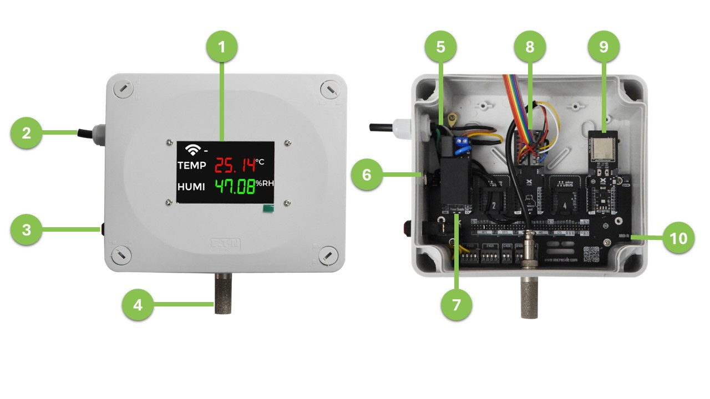<figcaption></figcaption></figure>

1. Pantalla **TFT** de 3.5″, resolución de 320x480px.&#x20;
2. Cable de alimentación 110 a 220VAC tipo B.
3. Interruptor de encendido/apagado con indicador de piloto.
4. Sensor de temperatura/humedad con cubierta de acero.
5. Porta fusible de 1A tipo europeo.
6. Botón pulsador de reinicio.
7. **X-NODE Power Supply AC.**
8. **X-NODE MCU WIFI BLE.**
9. **X-NODE Expansion Signal.**
10. Tarjeta de expansión **X-BOARD IIoTrainer**.

## III. Instalación


**¡ Advertencia !** Antes de conectar el dispositivo, lea cuidadosamente estas instrucciones y **retire todo el empaquetado de protección**, incluyendo el que se encuentra en el **interior del gabinete**. No hacerlo puede dañar el dispositivo.


### 1.- Desempaquetado

Con el objetivo de proteger al dispositivo durante el transporte, el gabinete tiene relleno de embalaje. Utilizando un destornillador plano, abra el gabinete girando los 4 seguros herméticos girando de la posición cerrado (A), en sentido contrario a las manecillas del reloj, a la posición abierto (B).

<figure>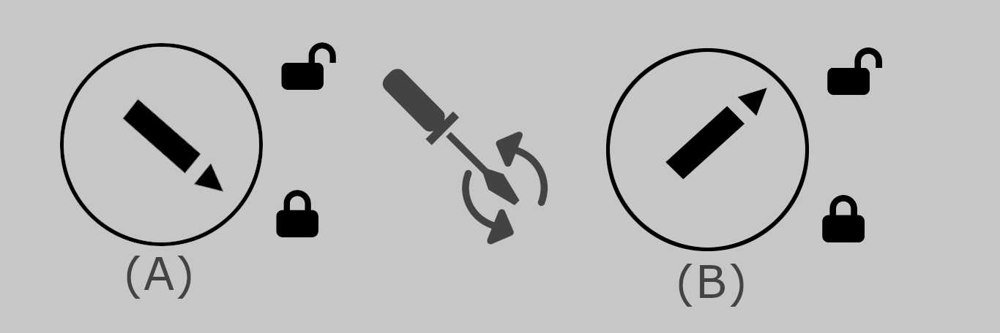<figcaption>
Posición cerrada (A), girar en sentido contrario a las manecillas del reloj a la posición abierta (B).
</figcaption></figure>

Levante la tapa, la cual se encuentra sujeta al resto del gabinete a través de unos sujetadores plásticos en la parte inferior y la pantalla TFT, que se encuentra conectada al sistema a través de un arnés de cable. Cuidadosamente remueva el relleno de embalaje del interior del gabinete, además, el conector se encuentra sujeto a la parte posterior de la tapa con cinta, remueva la cinta y corte el exceso del protector del arnés, tenga cuidado de no cortar los cables o el conector.

<figure>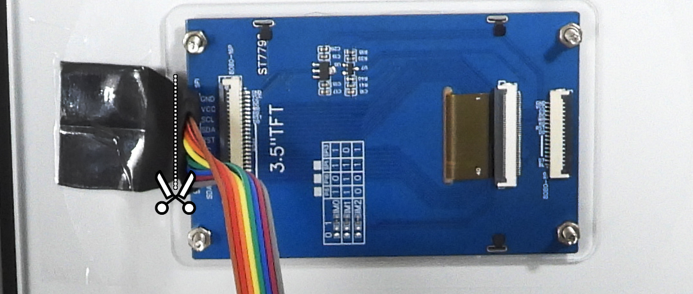<figcaption>
Guía para cortar el protector del arnés de cable de la pantalla.
</figcaption></figure>

Revise el contenido del gabinete, la sección [**Descripción del Hardware**](iot-hygrometer.md#ii.-descripcion-del-hardware) indica la posición que debe tener cada uno de los nodos, si durante el transporte alguno de los **X-NODE** no se encuentra en su respectivo zócalo conéctelo apropiadamente.


**¡ Advertencia !** Al conectar un **X-NODE** a los zócalos [**mikroBUS™**](https://www.mikroe.com/mikrobus), asegúrese que la posición sea correcta o podría dañar el dispositivo.


### 2. Conexión a la red eléctrica

Al terminar de retirar el relleno del embalaje, coloque la tapa y cierre el gabinete colocando los seguros herméticos en la posición de cerrado (A). A continuación, revise que el interruptor se encuentre en la posición de apagado (0) y conecte el dispositivo a la red eléctrica (110 o 220 VAC). Después accione el interruptor a la posición de encendido (1) lo que iluminará el piloto del interruptor, después espere 3-4 segundos mientras enciende el dispositivo, al hacerlo se mostrará la siguiente pantalla:

<figure>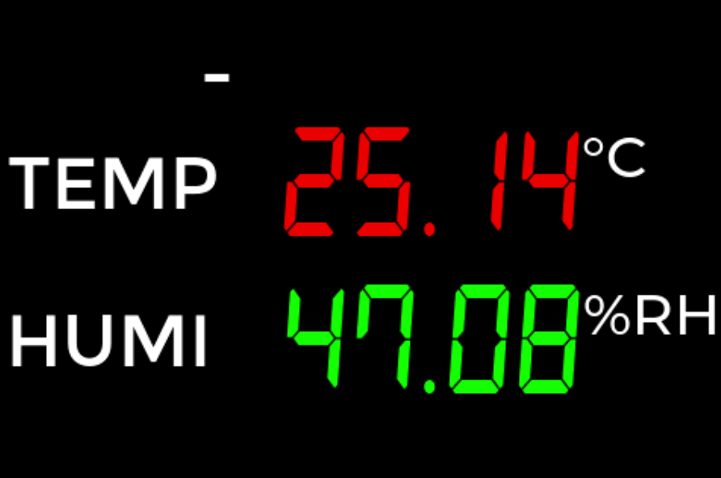<figcaption>
Pantalla inicial
</figcaption></figure>

Si el dispositivo no enciende coloque el interruptor en la posición de apagado (1) y desconéctelo de la red eléctrica, después abra el gabinete e inspeccione que los **X-NODE** estén correctamente conectados a los zócalos, también revise que los cables de alimentación AC estén correctamente conectados a la clema del **X-NODE Power Supply AC**, revise que el conector de la pantalla esté firmemente sujeto, y que los cables se encuentren conectados correctamente al **X-NODE Expansion Signal**, por último, revise que los jumper de configuración de la **X-BOARD IIoTrainer** se encuentren en la posición correcta.

### 3. Conexión a la nube

Para conectar el dispositivo a la nube deberá contar con una suscripción vigente.


Si no cuenta con una suscripción, o es la primera vez que adquiere un dispositivo, contacte con un representante de soporte, deberá proporcionar evidencia de la adquisición de la licencia y un correo electrónico para que se de alta una cuenta, también puede proporcionar un nombre de organización y logo para personalizar su plataforma de administración. Después recibirá un correo electrónico con instrucciones para crear una contraseña para su cuenta.


Descargue la aplicación móvil [Blynk para iOS](https://apps.apple.com/es/app/blynk-iot/id1559317868):

<figure>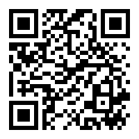<figcaption></figcaption></figure>

O para [Android](https://play.google.com/store/apps/details?id=cloud.blynk\&hl=es\&pli=1):

<figure>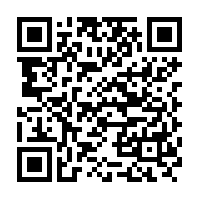<figcaption></figcaption></figure>

Abra la App de Blynk, si el dispositivo ya fue registrado y desea conectarlo a una red inalámbrica diferente consulte la sección: **Conectar el dispositivo a una nueva red Wifi.** Si es la primera vez que conecta el dispositivo a la nube presione el botón **+ Add new Device**, o el botón **+** (1)**.** Después seleccione la opción **Find devices nearby** (2), puede que la aplicación le solicite permisos para acceder a la red inalámbrica Wifi y Bluetooth. Después comenzará un escaneo para encontrar al dispositivo (3), si la aplicación no puede encontrarlo, utilice el botón pulsador para aplicar un reinicio al **Higrómetro IoT**, consulte la sección **Conectar el dispositivo a una nueva red Wifi** para obtener más información de este proceso.

<figure>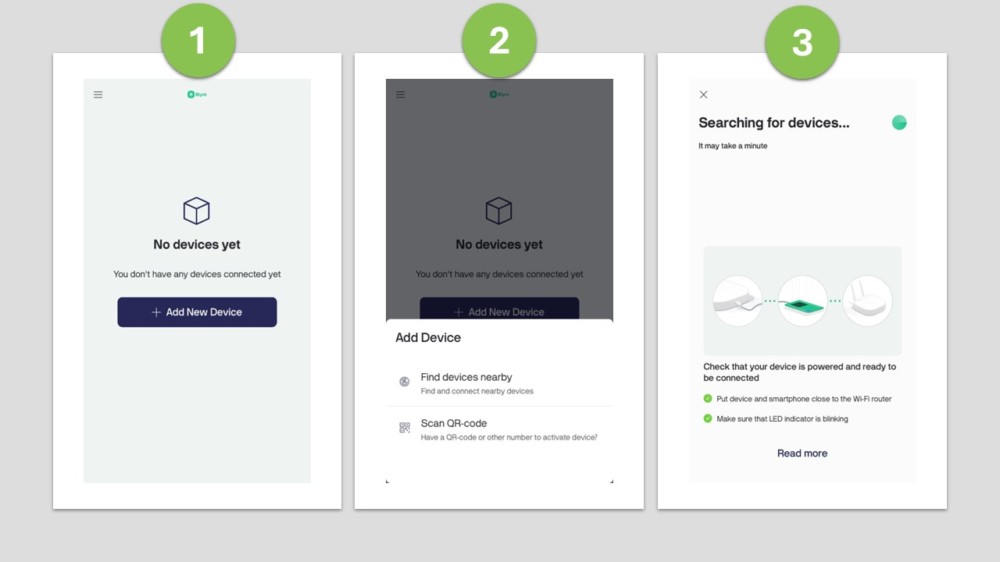<figcaption></figcaption></figure>

Al encontrar el dispositivo, la aplicación le preguntará si desea configurarlo, deberá presionar la opción **Conectarse** (4), espere unos segundos mientras la aplicación obtiene la información del dispositivo (5), después se mostrará una pantalla en donde deberá proporcionar el nombre de red y la contraseña de la red inalámbrica (6), después de proporcionar estos datos presione el botón **Continue**.  La pantalla del **Higrómetro IoT** mostrará una serie de iconos indicando el estado de la conexión, puede consultar su significado en la sección **Solución de problemas.**

<figure>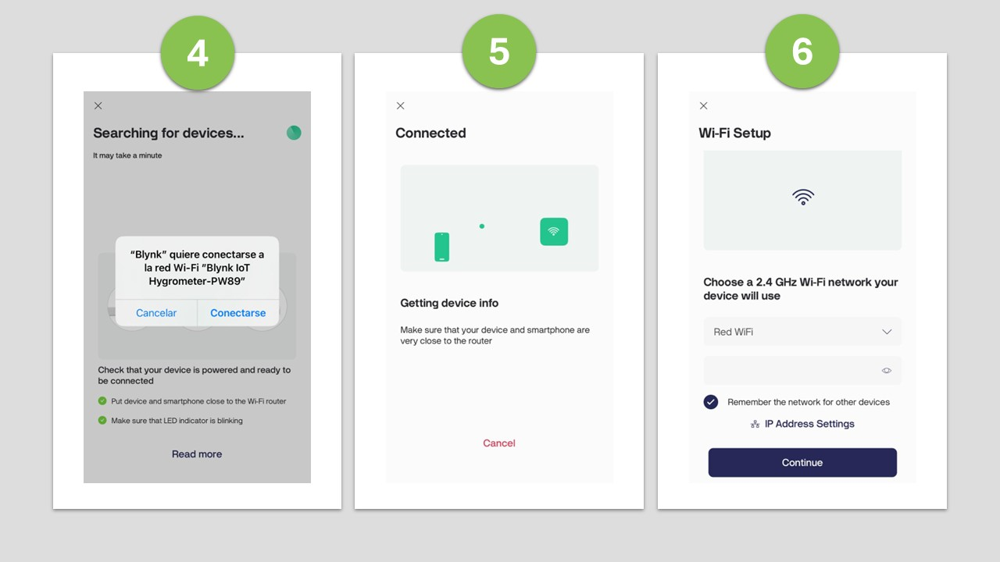<figcaption></figcaption></figure>

Configuración de IP estática y Red WiFi Oculta

Si su red inalámbrica no cuenta con servidor DHCP, o desea proporcionarle una IP estática al dispositivo deberá presionar el botón **IP Address Settings** (6-1), habilite la opción **Use static IP address** (6-2), después llene los campos de **dirección IP**, **máscara de subred**, **puerta de enlace** y **servidores DNS** (6-3).

Para conectarse a una **Red WiFi Oculta** presione el campo de Red WiFi y edite manualmente el nombre de la red. **Nota:** Presionar el botón (⌄) desplegará las redes disponibles cercanas.

<figure>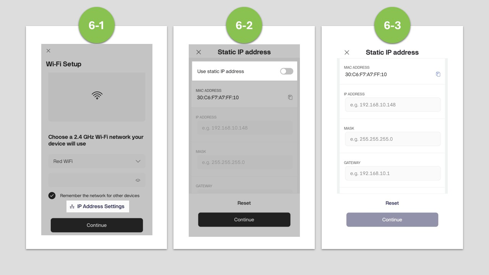<figcaption></figcaption></figure>


El dispositivo es compatible con redes inalámbricas **802.11b/g/n a 2.4GHz** con claves de seguridad **WEP/WPA-TKIP/WPA2-CCMP**, con servidores **DHCP o IP estática**. Si tiene problemas al conectar el dispositivo consulte con el administrador de la red para asegurarse que la configuración inalámbrica es correcta.


Si la conexión a la nube es exitosa se mostrará una página en donde podrá darle un nombre al dispositivo (7), presione el botón **Set Up Device,** a continuación,

&#x20;podrá proporcionar información sobre la ubicación en donde fue instalado (8), llene los campos y presione **Next,** presione **Finish** para finalizar la configuración.


La información en **Set Up** **Device** es opcional, son datos que el usuario puede utilizar para su administración y control en procesos internos. Si no desea proporcionar esta información puede omitirla dejando los campos vacíos y presionando el botón **Next.** Puede editar está información en cualquier momento a través de la aplicación de escritorio y móvil.


Al finalizar se mostrará el tablero móvil donde podrá observar las variables en tiempo real (9).

<figure>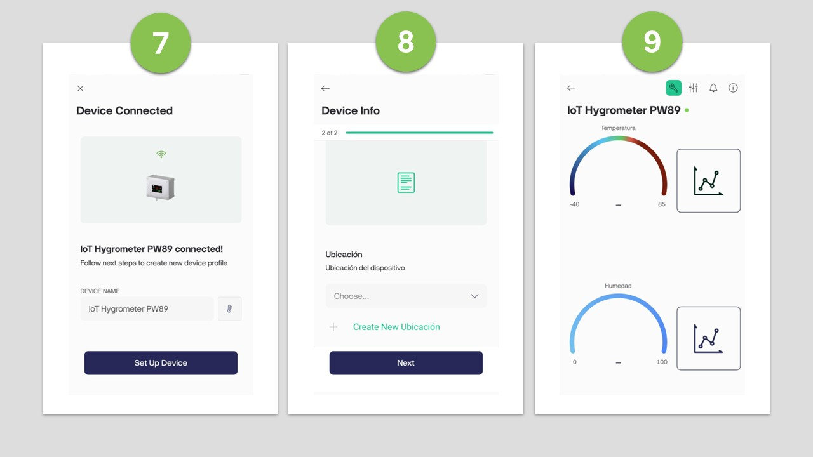<figcaption></figcaption></figure>

### 3.1 Aplicación de escritorio

[**Blynk.Console**](https://blynk.cloud/) ([http://blynk.cloud](https://blynk.cloud/)) es una aplicación para navegadores de escritorio. Para acceder a esta versión de la aplicación deberá iniciar sesión con un usuario con una suscripción vigente. Además de las funciones de la versión móvil, la aplicación de escritorio le permite administrar usuarios, sub-organizaciones, además, también puede descargar reportes de la información capturada por sus dispositivos.


Si no cuenta con una suscripción, o es la primera vez que adquiere un dispositivo, contacte con un representante de soporte, deberá proporcionar evidencia de la adquisición de la licencia y un correo electrónico para que se de alta una cuenta, también puede proporcionar un nombre de organización y logo para personalizar su plataforma de administración. Después recibirá un correo electrónico con instrucciones para crear una contraseña para su cuenta.


### 3.1.1 Descargar reportes

Los reportes contienen la información capturada por sus dispositivos y los eventos (conexiones, desconexiones, fallas) que se registraron durante un periodo de tiempo que puede ser de hasta 3 o 6 meses (dependiendo del tipo de suscripción). Para generar un reporte primero haga clic en el dispositivo del que desea obtener información desde la sección **Devices.**

<figure>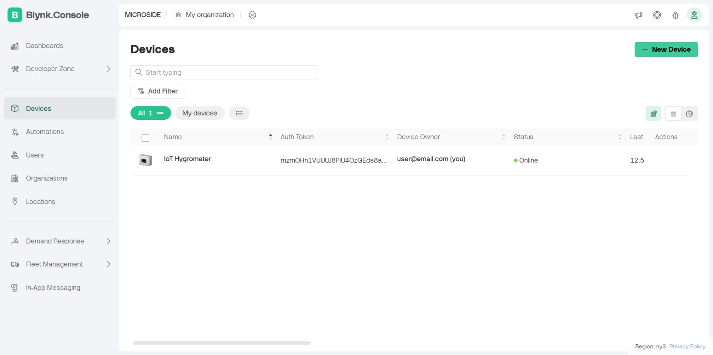<figcaption>
Sección <strong>Devices</strong> en <strong>Blynk.Console</strong>
</figcaption></figure>

Después haga clic en el botón **Descargar reporte** 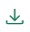que se encuentra debajo del nombre del dispositivo. Configure el periodo de tiempo y las variables de interés para el reporte. Puede decidir si incluir eventos (conexiones, desconexiones, fallas). Si habilita la opción **Send a link to e-mail**, puede enviar el enlace de descarga del reporte a un correo electrónico, el campo **RECIPIENTS** le permite seleccionar un correo de destino. Por último, en las opciones avanzadas puede usar **funciones de agregación**, en periodos de tiempo muy largos puede mostrar los datos por minutos, horas o días, utilizando el promedio, mínimo, máximo, suma y conteo, si no está seguro omita esta configuración. También puede editar la zona horaria para los reportes y el formato de fecha y hora. Presione el botón **Generate Report** para finalizar.


Solo puede generar hasta 10 reportes por dispositivo por día.


<figure>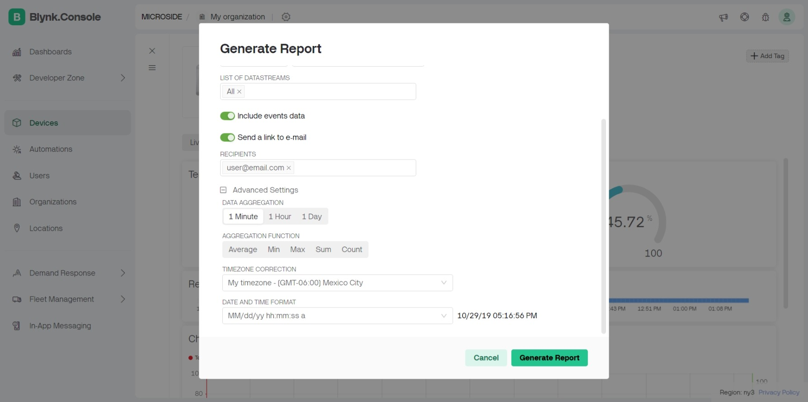<figcaption></figcaption></figure>

### 4. Recibir notificaciones (automatizaciones)

La aplicación móvil le permite recibir notificaciones en base al estado de las variables medidas, para configurarla presione el botón de **automatizaciones** (1), después presione el botón + **Create Automation / +**, seleccione el tipo de automatización **Device State**, seleccione el dispositivo del que quiere recibir notificaciones, después seleccione la variable que desea que genere la notificación:

* **Schedule:** Automatización útil para controlar dispositivos en base a rutinas y horarios.
* **Sunset/Sunrise**: Automatización basada en la zona horaria, se activa en base al amanecer y el atardecer.
* **Device state:** Automatización generada en base al estado de una variable.
* **Scene:** Automatización que debe ser activada por el algún usuario dentro de la organización.

<figure>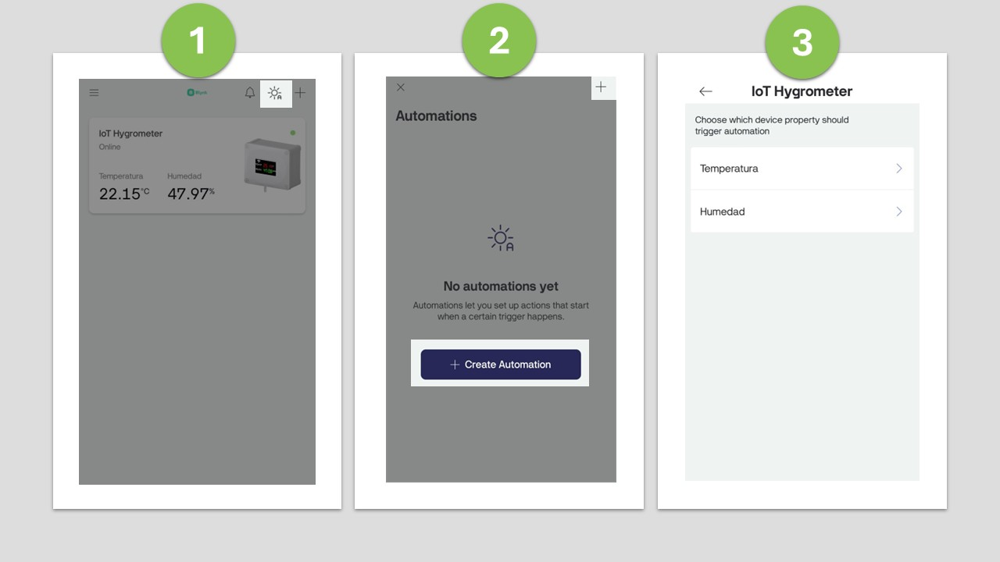<figcaption></figcaption></figure>

Seleccione la condición y los valores (si aplica) que generarán la notificación (4):

* **is greater than:** Cuando la variable supera un valor definido.
* **is greater than or equal to:** Cuando la variable es igual o mayor a un valor definido.
* **is less than:** Cuando la variable cae por debajo que un valor definido.
* **is less than or equal to:** Cuando la variable es menor o igual a un valor definido.
* **is equal to...:** Solo cuando la variable es exactamente igual a un valor definido.
* **is not equal to:** Cuando la variable no es exactamente igual a un valor definido.
* **is between ... and ...:** Cuando la variable se encuentra entre un rango definido entre dos valores.
* **is not between ... and ...:** Cuando la variable no se encuentra entre un rango definido entre dos valores.
* **has changed:** Cada vez que la variable cambia de valor.
* **is any:** Cada vez que se recibe información de la variable, incluso cuando no ha cambiado de valor.

En la sección **Do this** escoja el tipo de automatización (5), puede seleccionar más de una si presiona el botón **(+)**:

* **Control device**: Si cuenta con un dispositivo que lo permita, puede controlar actuadores con este tipo de automatización.
* **Send e-mail**: Envíe un correo electrónico automáticamente a alguno de los correos de las cuentas en su organización.
* **Send app notification**: Envía una notificación a su smartphone, asegúrese de activar las notificaciones de Blynk en la configuración de su teléfono para que esta opción funcione correctamente
* **Wait then do something:** Si desea esperar un tiempo antes de ejecutar una automatización.
* **Update device data:** Envíe el valor de la variable que generó la automatización a otro dispositivo.

En la sección **Settings** personalice el nombre de la automatización (5) y seleccione un límite de tiempo antes de que esta automatización puede volver a activarse, si escoge tiempos muy cortos puede, por ejemplo, recibir cientos de notificaciones en unos cuantos minutos, seleccione un límite que sea apropiado para su aplicación.

Una vez finalizada la configuración su automatización está lista, puede desactivarla en cualquier momento presionando el botón deslizable (6).

<figure>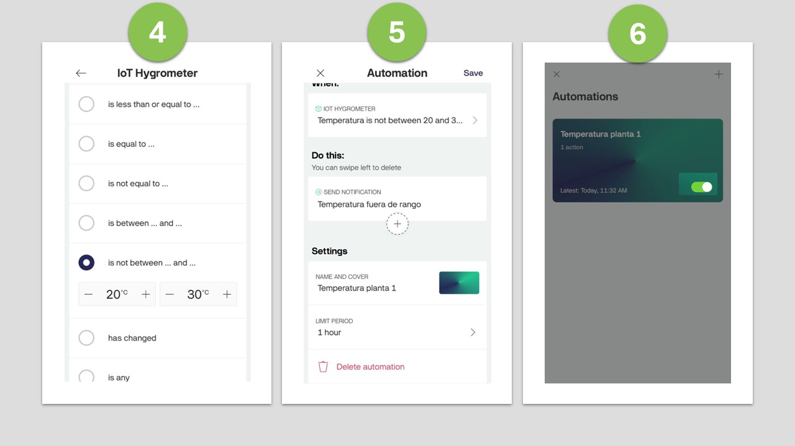<figcaption></figcaption></figure>


Para que las notificaciones funcionen debe **permitir** recibir notificaciones de la aplicación **Blynk IoT** en la configuración de su teléfono. En la App Móvil solo el usuario que creó la notificación podrá recibirla, utilice la versión de escritorio para personalizar los destinatarios.


### 4.1 Crear notificaciones (automatizaciones) desde la aplicación de escritorio

La aplicación de escritorio no puede recibir notificaciones, sin embargo, puede crearlas y personalizar parámetros adicionales, por ejemplo, los destinatarios. Para crear una automatización haga clic en la pestaña de **Automations** en [**Blynk.Console**](https://blynk.cloud/), seleccione el tipo de automatización **Device State.**

<figure>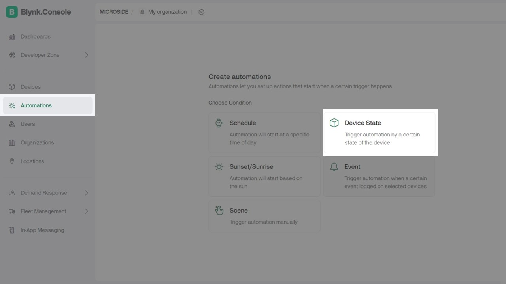<figcaption></figcaption></figure>

Asigne un nombre a la automatización y utilizando las listas desplegables seleccionone **el dispositivo** del que quiere recibir notificaciones, **la variable** y la **condición** que generará la notificación.  En la sección **Do this** escoja el tipo de automatización, puede seleccionar más de una si presiona el botón **(+) Add next action.** En la versión de escritorio además puede escoger los **Recipientes**, es decir, los usuarios de su organización que van a recibir la notificación. Además, en el mensaje puede arrastrar campos generados automáticamente cuando se dispara la automatización:

* **Organization name:** Nombre de la organización, las organizaciones pueden tener sub-organizaciones con motivos de administración y control, este campo le permite saber la organización donde se generó la automatización.
* **Timestamp**: Fecha y hora cuando se generó la automatización.
* **Trigger value**: El valor de la variable cuando se generó la automatización.
* **Device owner**: En organizaciones con múltiples usuarios puede asignar un _dueño_ a cada dispositivo, este valor hace referencia al _dueño_ del dispositivo cuando se generó la automatización.
* **Template name**: Es el modelo del producto.
* **Device name**: Nombre del dispositivo asignado durante la configuración.

<figure>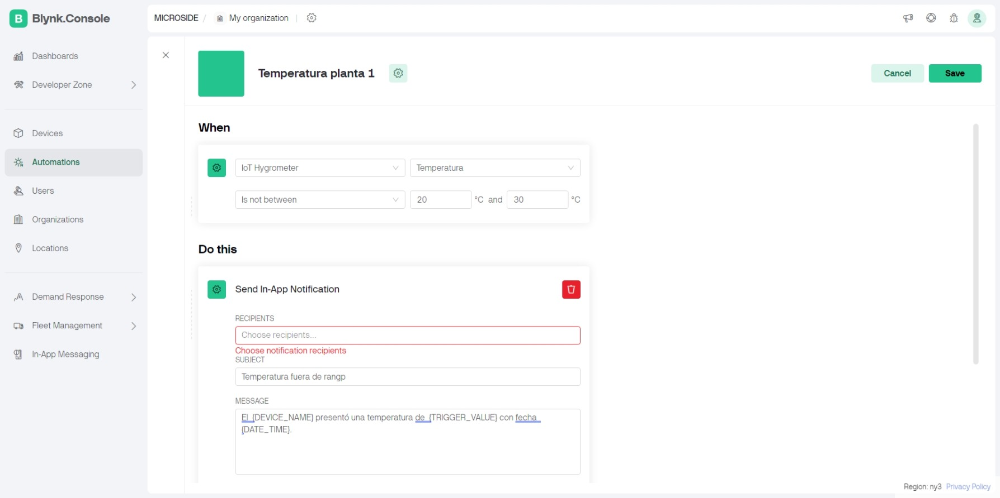<figcaption></figcaption></figure>

Con el botón de configuración  puede editar un límite de tiempo (**LIMIT PERIOD**) antes de que esta automatización puede volver a activarse, si escoge tiempos muy cortos puede, por ejemplo, recibir cientos de notificaciones en unos cuantos minutos, seleccione un límite que sea apropiado para su aplicación.

<figure>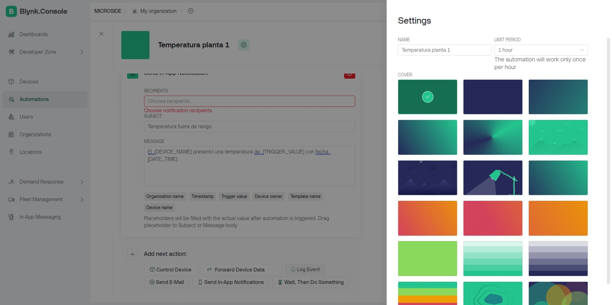<figcaption></figcaption></figure>

### 5. Conectar el dispositivo a una nueva red Wifi

Si el nombre de red Wifi o la contraseña cambiaron, o si desea cambiar la ubicación del dispositivo deberá reconfigurar el nombre de red. Con el dispositivo conectado y encendido debe presionar y mantener el **botón pulsador de reinicio** durante aproximadamente **15 segundos**. Al soltar el botón espere aproximadamente **5 segundos** mientras se reestablece la configuración, después apague el dispositivo **interruptor de encendido/apagado**, al encender el dispositivo estará listo para configurar un nuevo nombre de red y contraseña Wifi.

En la Aplicación móvil de Blynk seleccione el dispositivo que desea reconfigurar, después presione el botón de **información del dispositivo**, finalmente presione el botón (°°°) para desplegar las opciones adicionales, allí seleccione **Reconfigure**, al hacerlo se desplegará de **Búsqueda de dispositivos cercanos**. Siga las instrucciones de la sección **Conexión a la nube** a partir del punto 4.

<figure>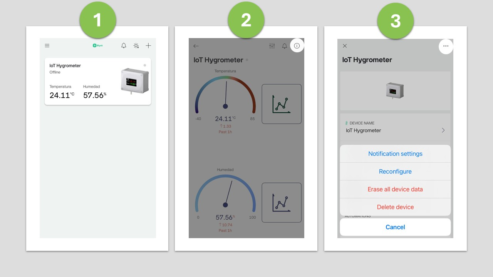<figcaption></figcaption></figure>


Si al reconfigurar un dispositivo utiliza la opción **(+) Add Device** en lugar de **Reconfigure**, el dispositivo se agregará como un nuevo dispositivo. Sin embargo, dependiendo de la cantidad de licencias en su suscripción, el dispositivo anterior **podrá ser eliminado** en un periodo de 24 horas y con ello toda la información capturada en ese periodo para motivos de generación de reportes. Si por error realizó esta operación y desea conservar los datos contacte con un representante de soporte inmediatamente para evitar la pérdida de información.


## IV. Preguntas frecuentes y solución de problemáticas

Mi dispositivo se desconecta de la nube/red frecuentemente

Revise la calidad de la señal inalámbrica en el sitio donde instaló el dispositivo, en la pantalla del **Higrómetro IoT** verifique el icono de Wifi.

* 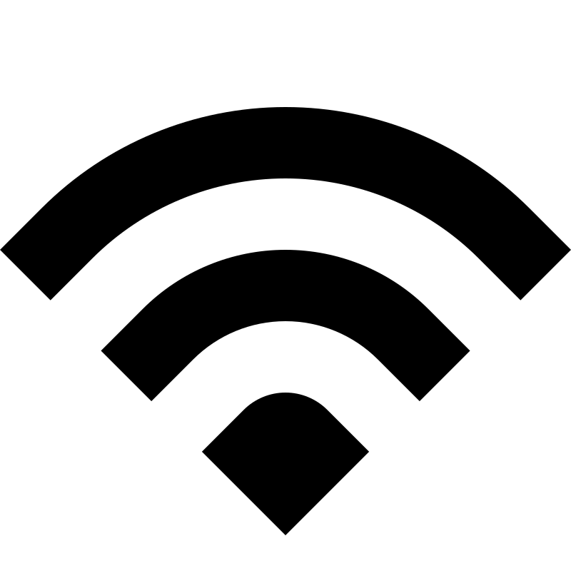 La señal es excelente, las desconexiones pueden deberse a problemas en la red.
* 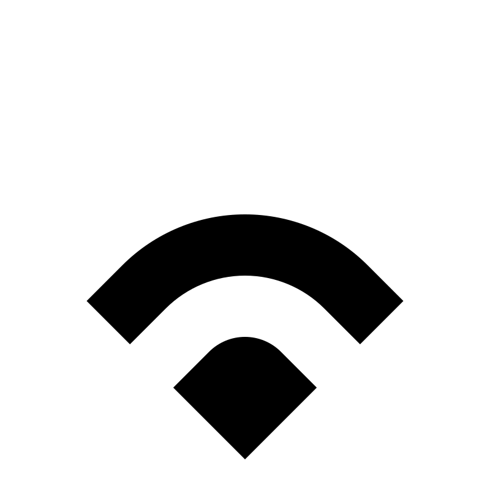La señal es buena, sin embargo, si es posible coloque el dispositivo en una posición con mejor recepción de señal o instale un punto de acceso más cercano si las desconexiones son frecuentes.
* La señal es pobre, coloque el dispositivo en una posición con mejor recepción o instale un punto de acceso más cercano.

Cuando el dispositivo se conecta a la red inalámbrica el icono de señal Wifi cambiará en secuencia ascendente. Si ocurre esto con frecuencia entonces es posible que la señal inalámbrica sea pobre o inestable.

El dispositivo no enciende

Revise el estado del interruptor de encendido/apagado, asegúrese que esté en la posición de encendido (1), si se encuentra en esa posición revise si la luz de piloto se encuentra encendida.

* La luz de piloto se encuentra apagada: Desconecte el equipo, retire la tapa del gabinete y reemplace el fusible, si la falla persiste contacte con soporte.
* La luz de piloto está encendida: Retire la tapa del gabinete y revise el estado de los leds del **X-NODE Power Supply AC**, si están apagados aún con el interruptor en la posición de encendidos, desconecte el equipo el equipo de la energía y revise que el cable esté correctamente conectado a la clema, si la falla persiste contacte con soporte.
* La luz de piloto y los leds del **X-NODE Power Supply AC** están encendidos: Revise si el dispositivo está en línea en la aplicación de Blynk. De no ser así realice el procedimiento para reiniciarlo, si la aplicación móvil puede encontrarlo, configurarlo y se conecta a la nube revise la problemática: **La pantalla del dispositivo no enciende**, de lo contrario contacte con soporte.

El dispositivo muestra OL/Error en los valores de temperatura/humedad

Significa que hay un error de comunicación con el sensor, desconecte el equipo y retire la tapa del gabinete, inspeccione el cableado que va desde la sonda del sensor hasta el **X-NODE Expansion Signal.** Si el cable está roto o si se encuentra desconectado, puede volver a conectarlo:

* Cable Rojo del sensor con la clema 3.3V.
* Cable Negro del sensor con la clema GND.
* Cable Blanco/Azul del sensor con la clema SDA.
* Cable Amarillo del sensor con la clema SCL.

Si el cable está correctamente conectado contacte con soporte.

El dispositivo se desconectó de la nube y no se vuelve a conectar

Puede ocurrir si se utilizó la opción **Reconfigure** cuando el equipo aún estaba conectado a una red inalámbrica, si se eliminó el dispositivo de la nube o si el nombre de red y contraseña WiFi cambiaron. Revise la aplicación de Blynk, identifique el dispositivo con la problemática y siga el proceso para **Conectar el dispositivo a una nueva red Wifi.**

<strong>La pantalla del dispositivo no enciende</strong>

Primero revise si el dispositivo enciende, retire la tapa del gabinete y observe el estado de los LEDs del **X-NODE Power Supply AC**, si están apagados revise la problemática **El dispositivo no enciende.** Si el dispositivo enciende y se conecta a la nube con normalidad, entonces revise que el cableado que va hacia la pantalla. Si alguno de los cables no se encuentra correctamente conectado deberá volver a conectarlo con el **X-NODE Expansion Signal.**:

* Pin **GND** de la pantalla (cable marrón) con la clema **GND**.
* Pin **VCC** de la pantalla (cable rojo) con la clema **5V**.
* Pin **SCL** de la pantalla (cable naranja) con la clema **SCK.**
* Pin **SDA** de la pantalla (cable amarillo) con la clema **MOSI.**
* Pin **RST** de la pantalla (cable verde) con la clema **RST.**
* Pin **DC** de la pantalla (cable azul) con la clema **MISO.**
* Pin **CS** de la pantalla (cable guinda) con la clema **CS.**
* Pin **BL** de la pantalla (cable gris) con la clema **PWM**.

Si los cables están correctamente conectados puede intentar reemplazar el arnés por uno nuevo, utilizando cables tipo DuPont con un paso de 2.54mm. Si al reemplazar el arnés la falla persiste contacte a soporte.

¿Qué significan los iconos en la pantalla del Higrómetro IoT?

* 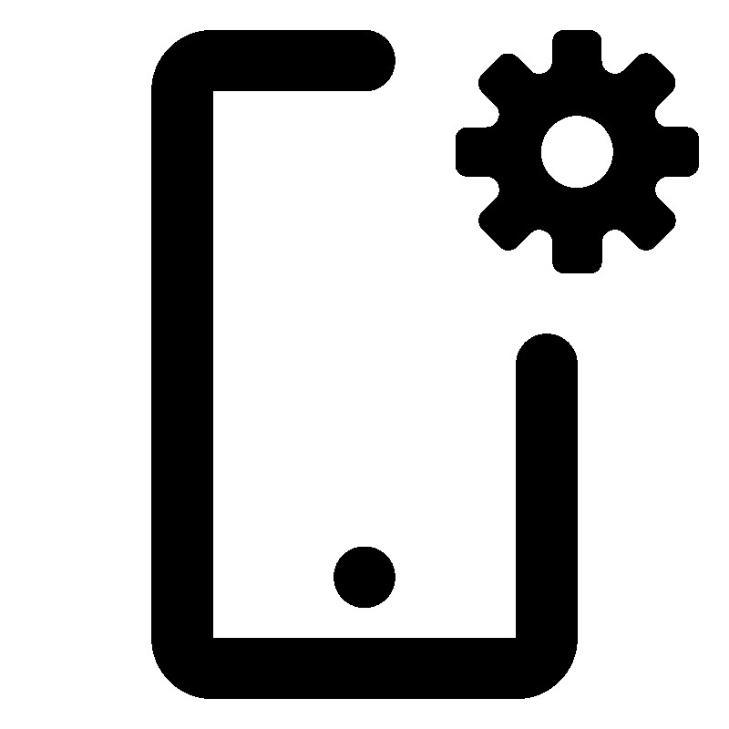 Indica que el dispositivo está siendo configurado a través de la aplicación móvil Blynk.
* 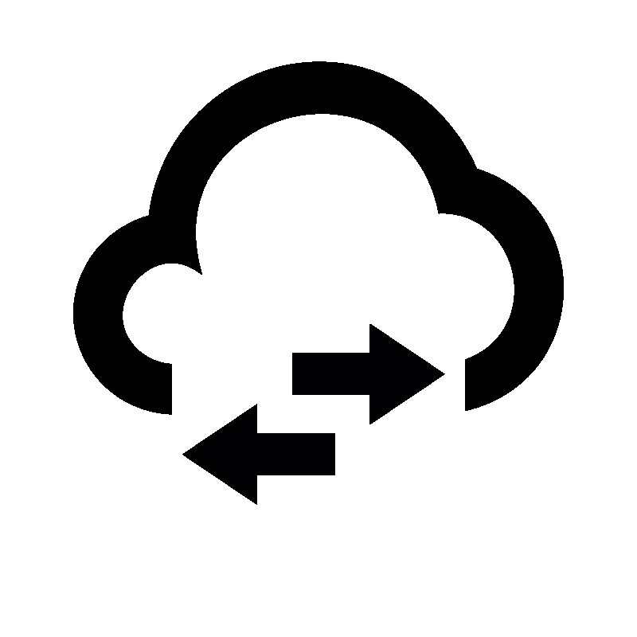 Indica que el dispositivo se está conectando a la nube de Blynk. También se muestra durante las reconexiones a la nube.
* 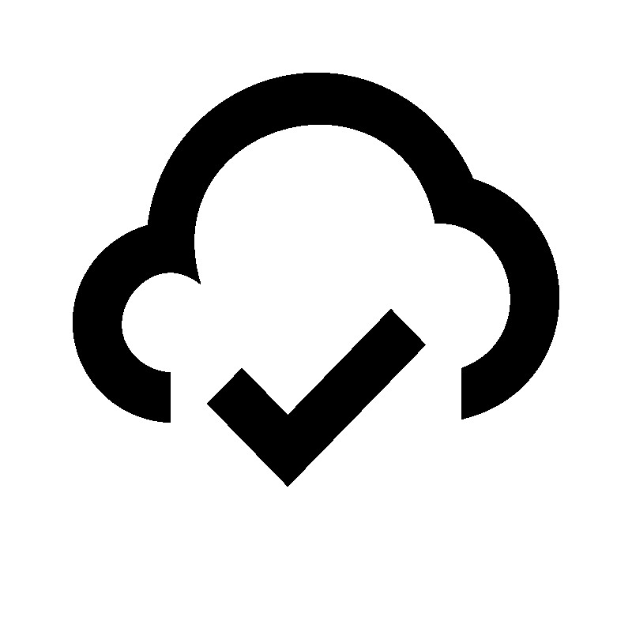 Indica que el dispositivo está conectado y reportando a la nube de Blynk.
* 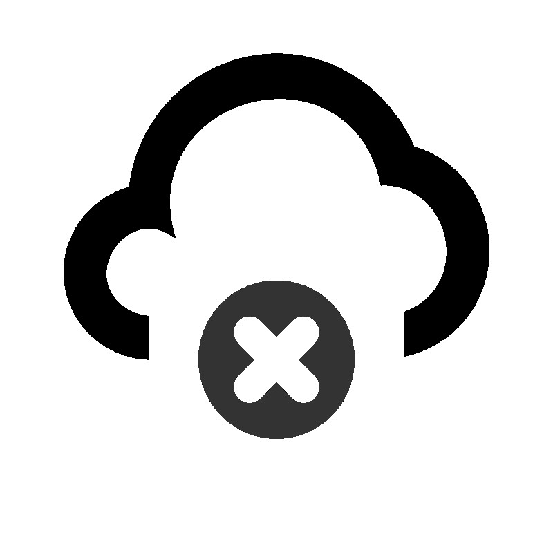 Indica que la conexión a la nube falló, puede deberse a que se eliminó el dispositivo desde Blynk o se utilizó la opción **Reconfigure.** Consulte la sección **Conectar el dispositivo a una nueva red Wifi.**
* 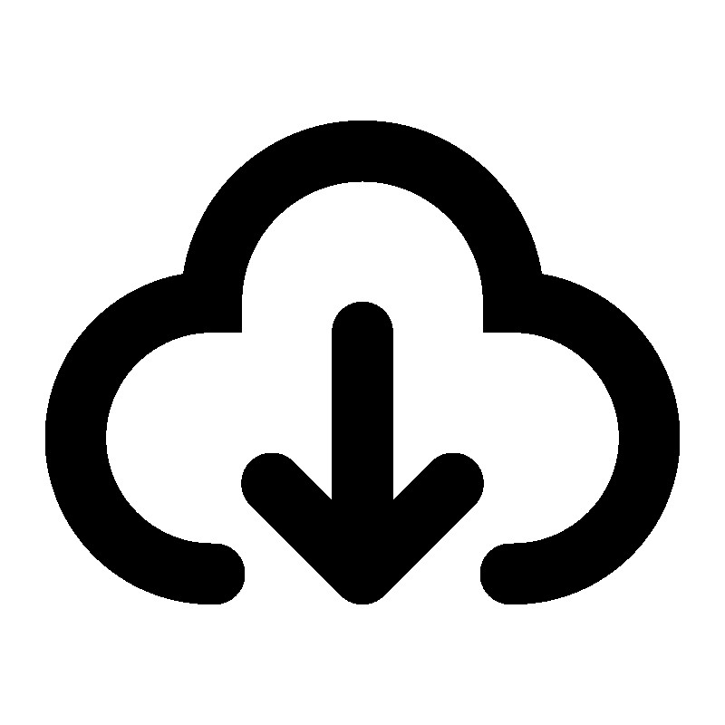 Indica que una **actualización de firmware** se está llevando a cabo, no desconecte el dispositivo durante este proceso.

La aplicación Blynk indica que hay una actualización de firmware para mi dispositivo

Las actualizaciones de firmware permiten añadir funcionalidad, corregir errores, proteger al dispositivo contra vulnerabilidades, es importante mantener al dispositivo actualizado, el proceso de actualización puede demorar unos cuantos minutos, considérelo antes de comenzar el proceso de actualización.

